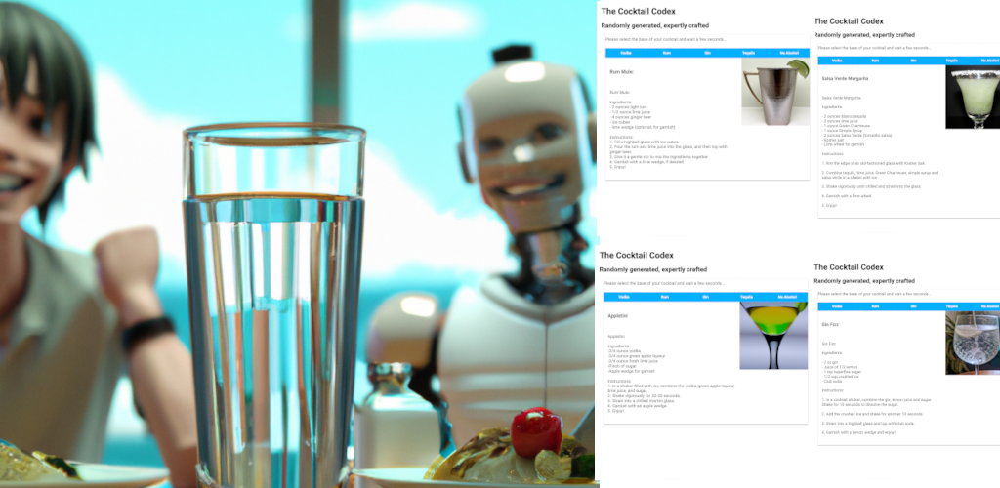
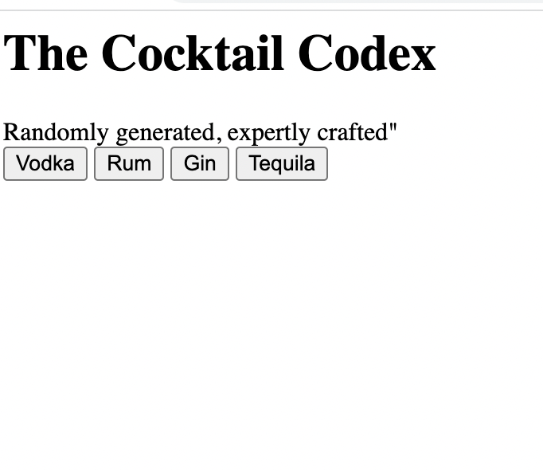
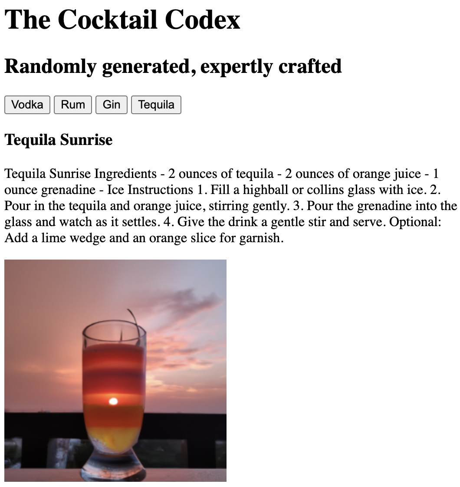
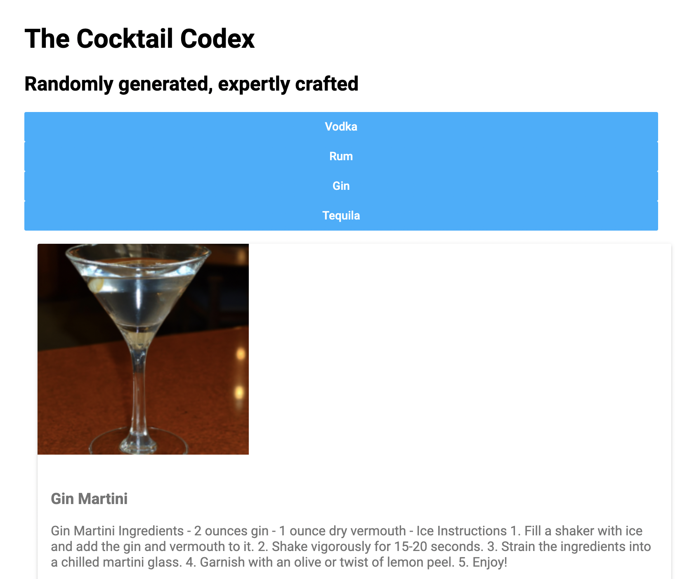
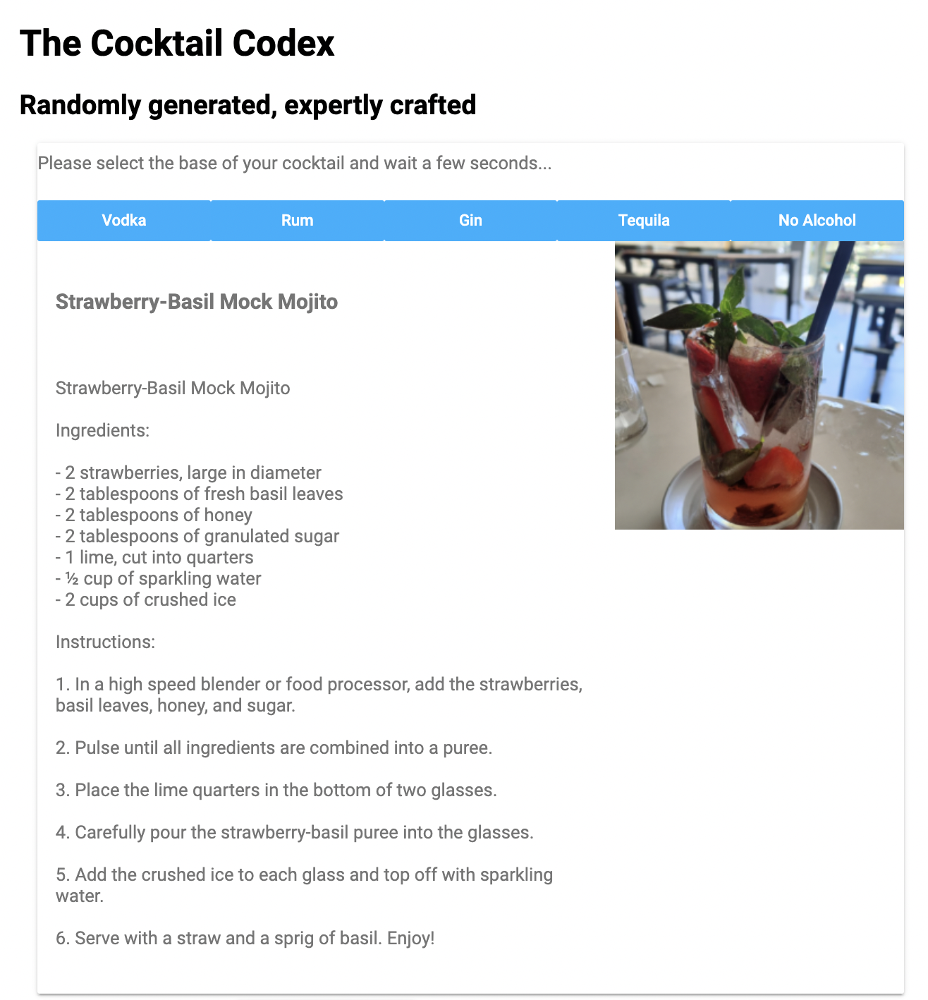

# The Cocktail Codex - A shot of ChatGPT !

## Testing ChatGPT potential in code generation

We took on the challenge of creating an AI-powered cocktail recipe generator for a fictional cocktail bar owner who has limited computer knowledge and wants to replace his limited cocktail menu : Using a tablet, customers can choose their preferred ingredients and a customized, AI generated cocktail recipe is delivered in real-time to the bar tender. 

Our goal was to push the boundaries of what ChatGPT can achieve when it comes to independently developing the code for this application, which itself leverages OpenAI's services to generate the recipes (namely davinci for the recipe and Dall-e for the illustration). 

In less than two hours and with only 17 questions, we were able to have ChatGPT creating a functional, albeit imperfect, web page that met our needs. 

ChatGPT delivered names and slogans for the bar, generated the code (HTML/JS), provided recommendations for testing and bug fixing, and suggested improvements to the user interface (CSS/HTML).  

In total, more than 95% of the code generated by ChatGPT remained unchanged. 

---

## How to use it

Being a single page HTML prototype interacting with OpenAI API, you need to provide your own OpenAI API KEY
https://help.openai.com/en/articles/4936850-where-do-i-find-my-secret-api-key

Update the cocktail-codex.html file to replace YOUR_API_KEY by you own API key (2 replacements to be done)

Open the cocktail-codex.html file in your favorite browser, and enjoy !

---

## How it was done

The starting point was this request to ChatGPT : 
>*The code of one page website, with an icon, the name and the slogan of the bar at the top.*
>
>*The user selects the base alcohol of his cocktail by clicking on the corresponding button.*
>
>*A cocktail recipe (cocktail name, ingredients, instructions) containing this alcohol is then automatically generated by requesting the OpenAI API.*
>
>*An image of the cocktail is generated by interacting with the DALL-E API, asking an image corresponding to the cocktail name*
>
>*The cocktail recipe and the cocktail image are then displayed below.*

You can find in the following 4 directories :
1. Conversations with ChatGPT for each step
2. The resulting source code
3. An illustration of the outcome

|  Step | # questions | Duration | Result |
|-----------------|-----------------|-----------------|-----------------|
| V1 - Name and initial code | 5 questions   | 12 mins    |     |
| V2 - API Correction | 3 questions + 5 manual corrections    | 36 mins    |     |
| V3 - First UI | 2 questions    | 7 mins    |     |
| V4 - UI and Features correction | 7 questions    | 23 mins    |     |

You can see additional ChatGPT capabilities in the "bonus" directory, such as reverse engineering, utilizing Gherkin for behavior-driven development, incorporating unit tests.

---

## Key Takeaways

In summary:

1. It is clear that ChatGPT is capable of producing good-quality code when provided with high-level descriptions.
2. However, as demonstrated in this example, a non-technical user may struggle on some issues (eg in this example to properly format requests for querying OpenAI APIs).
3. Currently, we see the most potential for ChatGPT in assisting developers in expanding their skill sets, such as a back-end developer creating a front-end.
4. Other potential use cases to consider include code reverse-engineering, code improvement, and automated documentation generation.

And the final words come from ChatGPT itself !!

>The code is crafting the most expertly generated random cocktails the internet has ever seen 🍸🍹🥃. 
>With a choice of vodka, rum, gin, tequila, and even non-alcoholic options 🍹🍸🍺, this website has something for everyone. 
>
>It's so cutting edge 🤖, it even uses a special font from Google 💻 and has a fancy image 📷. 
>The design is so sleek 🕺💄, you might even think it's good enough for a fancy bar 🍸🍹🥃. 
>
>But don't take my word for it, go ahead and click those buttons 🔘 and see for yourself! 🚀

---